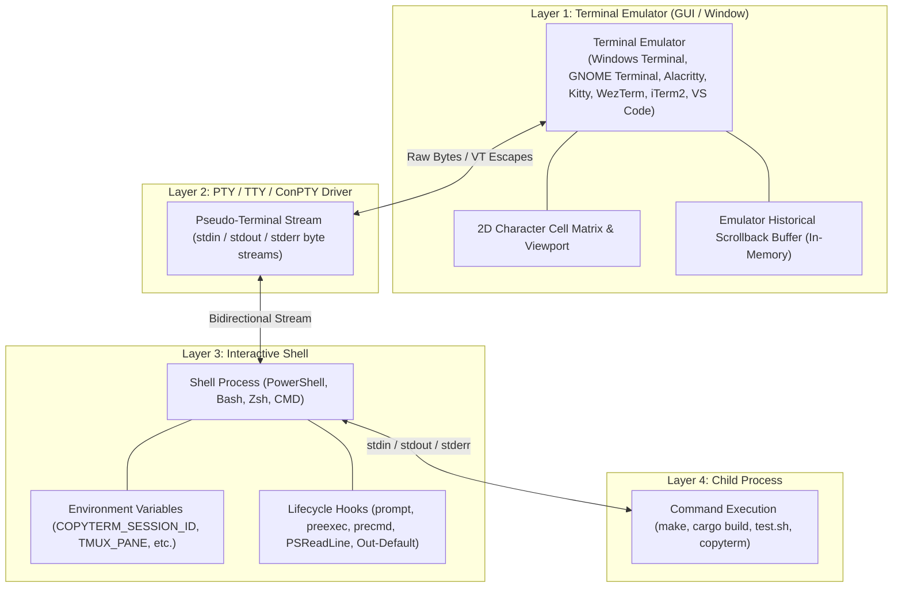
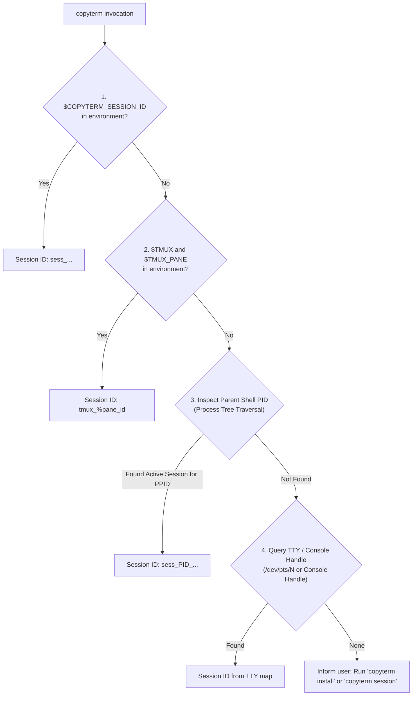
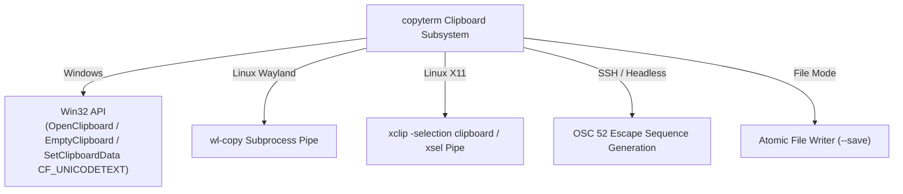

# COPYTERM Architecture Proposal: Cross-Platform Terminal Session Capture

**Document Version:** 1.0.0  
**Status:** Approved Architecture Proposal  
**Author:** copyterm Architecture Team  

---

## 1. Executive Summary & Problem Definition

Developers frequently manage dozens of simultaneous terminal tabs, windows, and panes (e.g. 30+ terminals running independent builds, local microservices, test runners, REPLs, and SSH connections). While the standard command `clear` wipes the visual terminal screen, there has never been an equally intuitive, universal counterpart to copy the terminal's session output:

```text
copyterm
```

When a developer types `copyterm`, the entire useful output of **that specific terminal session** should be formatted and placed directly onto the OS clipboard.

### Core Non-Negotiable Requirement: Absolute Session Isolation
If 30 terminals are open concurrently:
- Running `copyterm` in Terminal #1 **must only** copy Terminal #1's output.
- Running `copyterm` in Terminal #14 **must only** copy Terminal #14's output.
- Running `copyterm` in Terminal #30 **must only** copy Terminal #30's output.
- Under zero circumstances may a global buffer or shared state mix outputs between distinct sessions.

---

## 2. Technical Realities & Terminal Architecture Analysis

Before designing the capture engine, we must dissect the layers involved in terminal execution:



### Critical Findings on Historical Scrollback:
1. **The Terminal Emulator owns the GUI scrollback buffer.**  
   Terminal emulators (such as Windows Terminal, GNOME Terminal, Alacritty, and VS Code) maintain their own internal ring buffer of visual rows that have scrolled off-screen.
2. **Standard PTY/ConPTY interfaces are one-way stream pipes.**  
   A child process (like `copyterm`) running inside a shell receives standard file handles connected to the PTY. The PTY driver does **not** provide a POSIX or ConPTY API for a child process to reach back up into the GUI emulator and extract historical text that passed through the pipe hours earlier.
3. **Specialized exceptions:**
   - **`tmux`**: Maintains an independent server-side pane scrollback buffer accessible via `tmux capture-pane -p -S - -J -t <pane_id>`.
   - **Legacy ConHost (Windows Console)**: Exposes `GetConsoleScreenBufferInfo` and `ReadConsoleOutputCharacter`, but this only covers the active console screen buffer height and is bypassed in modern ConPTY / Windows Terminal.
   - **Kitty / WezTerm**: Expose dedicated IPC command interfaces (`kitty @ get-text`, `wezterm cli get-text`) if enabled.

### Conclusion for Capture Architecture:
`copyterm` uses a **robust Hybrid Architecture**:
- **Tmux Sessions:** Queries the native `tmux capture-pane` engine directly for immediate access to the full pane scrollback history.
- **Shell Sessions (PowerShell, Bash, Zsh, CMD):** Uses lightweight, non-intrusive shell integration hooks and session journals that capture all commands and outputs starting from shell initialization.
- **PTY Session Wrapper (`copyterm session [cmd]`):** Spawns an explicit duplex PTY wrapper that tees 100% of terminal I/O into the session ring buffer in real time.

---

## 3. Session Identification & Isolation Architecture

To ensure 30+ (and up to 100+) concurrent terminals remain 100% isolated, `copyterm` implements a multi-tier session resolution hierarchy:



### Session ID Format
Each session receives a globally unique, collision-resistant identifier:
```text
sess_<unix_timestamp_ms>_<pid>_<random_token>
```
Example: `sess_1773600000_14820_a9f2`

### Storage Layout (`~/.copyterm/sessions/`)
All sessions are stored in an isolated per-user directory with strict file permissions (`0700` / Windows ACLs restricted to current user):

```text
~/.copyterm/
├── config.json              # Global configuration (max_buffer_size, redaction rules)
└── sessions/
    ├── sess_1773600000_14820_a9f2.meta    # Session metadata (shell, pid, cwd, start_time)
    ├── sess_1773600000_14820_a9f2.buf     # Bounded circular ring buffer
    ├── sess_1773600015_28104_b3c1.meta
    ├── sess_1773600015_28104_b3c1.buf
    └── ...
```

---

## 4. Bounded Ring Buffer Design

Terminal sessions can run for weeks and generate millions of lines. To prevent runaway disk and memory consumption:
- Each session buffer is bounded by a configurable size limit (default: **10 MB** / **50,000 lines** per session).
- Writes use a file-backed circular ring buffer with atomic header updates.
- Tail retrieval (`copyterm --last 100`) seeks directly from the end of the file backwards, loading only the necessary bytes into RAM.
- An automatic garbage collector cleans up sessions whose parent process has exited or whose heartbeat is older than 24 hours.

---

## 5. Stream Sanitization & ANSI/VT Processing

Raw terminal output is filled with escape sequences, ANSI color codes, cursor repositioning commands, and carriage returns (`\r`).

### Carriage Return (`\r`) & Backspace (`\b`) Line Simulation
CLI tools (such as `npm`, `cargo`, `docker pull`, `wget`, `pip`, and progress bars) emit carriage returns to overwrite the current terminal line:
```text
[=>        ] 10%\r
[=====>    ] 50%\r
[==========] 100%\n
```
Blindly copying this stream results in a messy jumble of progress bar fragments.  
The `copyterm` sanitizer implements a **virtual 1D line-buffer state machine**:
- Interprets `\r` as resetting the virtual cursor to column 0.
- Overwrites existing characters in the line buffer.
- Emits the clean, final visual state upon encountering `\n` or flush.

### Escape Sequence Stripper (`--clean` vs `--raw`)
- In default and `--clean` mode: Strips all ANSI SGR (`\x1b[...m`), cursor movement (`\x1b[A-H]`, `\x1b[2K`), OSC titles (`\x1b]0;...\x07`), and private mode switches.
- In `--raw` mode: Preserves all VT sequences for exact terminal replay.

### Secret Redaction (`--redact`)
Detects and masks sensitive credentials before copying to clipboard:
- AWS Access Keys (`AKIA[0-9A-Z]{16}`)
- GitHub Personal Access Tokens (`ghp_[0-9a-zA-Z]{36}`)
- Private Key Headers (`-----BEGIN [A-Z ]*PRIVATE KEY-----`)
- Bearer / JWT Tokens (`eyJ...`)
- Generic API keys and passwords in common formats (`password=...`, `api_key=...`)

---

## 6. Native Clipboard Abstraction

`copyterm` avoids external dependencies by interfacing directly with OS clipboard backends:



---

## 7. Shell Integrations (Safe, Non-Destructive, Idempotent)

`copyterm install` automatically detects the user's shell and appends a cleanly demarcated block to the user profile:

### PowerShell Integration (`copyterm.ps1`)
- Hooks `prompt` function and PSReadLine execution pipeline.
- Assigns `$env:COPYTERM_SESSION_ID` at shell launch.
- Captures command lines, working directory, timestamps, exit codes, and output.

### Bash Integration (`copyterm.bash`)
- Hooks `PROMPT_COMMAND` and `trap '...' DEBUG` / `PS0`.
- Ensures zero interference with exit codes (`$?`), signals, or job control.

### Zsh Integration (`copyterm.zsh`)
- Uses standard `preexec` and `precmd` hooks.

### CMD Integration (`copyterm.cmd`)
- Provides `doskey copyterm=...` and session wrapper integration.

---

## 8. Verification & Multi-Session Isolation Proof Plan

1. **Automated Unit Test Suite:**
   - Ring buffer wrap-around, tail line parsing, ANSI sanitization, secret redaction, formatting modes.
2. **30+ Concurrent Session Isolation Test:**
   - Spawns 30 concurrent sub-processes simulating independent terminal sessions.
   - Writes unique markers (`SESSION_MARKER_01` to `SESSION_MARKER_30`).
   - Executes `copyterm` in each session.
   - Asserts that session $k$'s output contains **only** `SESSION_MARKER_k` and no cross-talk from any of the other 29 sessions.
3. **High-Volume Asymmetric Test:**
   - Session A produces 10,000 lines of high-speed output.
   - Session B produces 5 lines of output.
   - `copyterm` from Session B verifies instant retrieval of only Session B's 5 lines.
