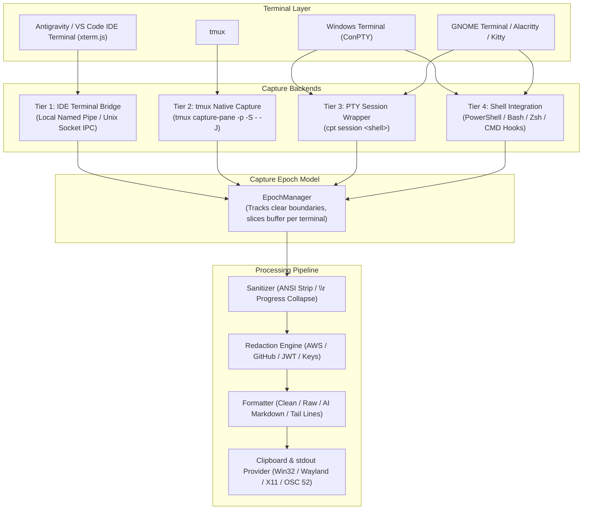

# COPYTERM Architecture & Technical Deep Dive

## 1. System Overview

`cpt` (CopyTerm) is an end-to-end, cross-platform terminal capture utility engineered to capture the active terminal's complete available output and place it cleanly onto the system clipboard with strict per-terminal isolation and epoch boundary tracking.



---

## 2. The Capture Epoch Model (`clear` as a Copy Boundary)

The core principle of CopyTerm is:
- **`clear`** (or `cls`, `Clear-Host`) establishes a new **Capture Epoch** boundary (`epoch += 1`).
- **`cpt`** captures all retained terminal content belonging to the **CURRENT** epoch of the **CURRENT** terminal.

```
TERMINAL BUFFER
├── OLD EPOCH (Epoch 0)
│   ├── line 1
│   ├── line 2
│   └── [clear executed]   <-- Advances epoch to Epoch 1
│
└── CURRENT EPOCH (Epoch 1)
    ├── command3 output
    ├── command4 output
    └── cpt                <-- Captures ONLY Current Epoch
```

### Epoch State Machine
1. **Initial State (`epoch_id == 0`)**:
   - When no `clear` command has occurred in the session, `cpt` operates in 100% retroactive mode, capturing the full terminal buffer from before CopyTerm started.
2. **Clear Interception**:
   - When the user runs `clear`, `cls`, or `Clear-Host`, the shell wrapper increments `__copyterm_epoch`, writes the updated state to `~/.copyterm/sessions/<session_id>.epoch`, and executes the host terminal clear.
3. **Buffer Slicing**:
   - When `cpt` captures the terminal buffer, `EpochManager.slice_buffer_by_epoch()` identifies the boundary (via boundary tokens, prompt clear matches, or transcript restarts) and excludes all content generated prior to the latest clear.
4. **Echo Safety**:
   - Output like `echo "clear"` or `printf "clear\n"` does not execute the shell clear command and thus does not advance the epoch.
5. **Retained Scrollback Preservation**:
   - Slicing occurs strictly at the clear boundary; if 5,000 lines were generated *after* `clear`, all 5,000 retained lines are captured (not limited to viewport).

---

## 3. Tier 1: CopyTerm IDE Terminal Bridge Architecture

The IDE Terminal Bridge connects the CLI directly to the Antigravity IDE / VS Code `xterm.js` renderer memory:

```
┌────────────────────────────────────────────────────────┐
│               Chromium Renderer Process                │
│         (out/vs/workbench/workbench.desktop.main.js)   │
│                                                        │
│   xterm.js Terminal Instance (5.6.0-beta.136)          │
│   - Retained Buffer & Historical Scrollback            │
└───────────────────────────┬────────────────────────────┘
                            │ Electron IPC
┌───────────────────────────▼────────────────────────────┐
│               Extension Host Node Process              │
│       (out/vs/workbench/api/node/extensionHostProcess.js)│
│                                                        │
│   CopyTerm IDE Bridge Extension                        │
│   - IPC Server (Named Pipe / Unix Domain Socket)       │
│   - Ephemeral 256-bit Token Authentication             │
│   - Deterministic Caller PID Terminal Matcher          │
│   - Clipboard State Guard (Preserve & Restore)         │
└───────────────────────────▲────────────────────────────┘
                            │ Local Authenticated IPC
┌───────────────────────────┴────────────────────────────┐
│                        cpt CLI                         │
│   - Resolves caller PID via ancestor inspection        │
│   - Requests xterm.js buffer via IPC                   │
│   - Slices buffer at active epoch boundary             │
│   - Applies Sanitizer & Redactor                       │
│   - Emits to Clipboard / stdout / file                 │
└────────────────────────────────────────────────────────┘
```

### IPC Protocol Specification (v1)
- **Windows**: Named Pipe `\\.\pipe\copyterm-ide-<USER_HASH>`
- **Linux/macOS**: Unix Domain Socket `~/.copyterm/ide_bridge.sock`
- **Discovery**: `~/.copyterm/ide_bridge.json` (contains endpoint, auth token, and capabilities).

---

## 4. Multi-Terminal Isolation & PID Matching

To guarantee that 30+, 100+ concurrent terminals never cross-contaminate:
1. **Deterministic PID Binding**: The extension queries `vscode.window.terminals` and matches `terminal.processId === caller_pid`.
2. **Ambiguity Prevention**: If no matching terminal process is found in the ancestor tree, the bridge rejects the request and provides diagnostics.
3. **Independent Epochs**: Every terminal possesses its own distinct session file (`sess_<id>.meta` and `sess_<id>.epoch`). Resetting Terminal A has zero effect on Terminal B.
