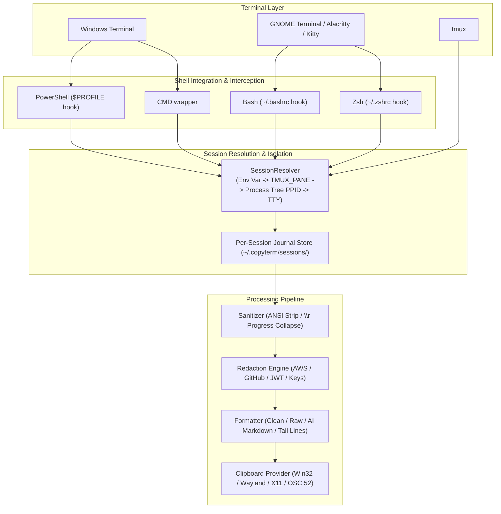

# COPYTERM Architecture & Technical Deep Dive

## 1. System Overview

`copyterm` is an end-to-end, cross-platform terminal session capture utility engineered to capture the active terminal's session output and place it cleanly onto the system clipboard with strict per-terminal isolation.



---

## 2. Terminal Layer vs Shell Layer vs PTY

To understand why `copyterm` is designed this way, we must distinguish the responsibilities of each layer:

| Layer | Responsibility | State Owned | Access via Child Process |
| :--- | :--- | :--- | :--- |
| **Terminal Emulator** (GUI) | Renders 2D character grid, viewport scrolling, window management | Visual 2D screen buffer, GUI scrollback history | **Inaccessible over standard PTY** |
| **PTY / ConPTY Driver** | Bidirectional character byte pipe between emulator and shell | Stream buffers, termios settings | Streams only (cannot seek backwards) |
| **Interactive Shell** | Interprets commands, expands variables, launches child processes | Execution lifecycle, working directory, history | Hookable via shell functions / trap |
| **Child Process (`copyterm`)** | Ephemeral process executed by shell | Command arguments, inherited environment, stdin/stdout/stderr | Process tree inspection, filesystem access |

---

## 3. Session Identification & Isolation Mechanics

To guarantee that 30+, 100+ concurrent terminals never cross-contaminate:

### Tier 1: Environment Variable (`$COPYTERM_SESSION_ID`)
When a shell starts with `copyterm` integration installed:
```text
COPYTERM_SESSION_ID="sess_<timestamp_ms>_<pid>_<random_hex>"
```
This variable is unique to that shell instance and automatically inherited by any command executed within that terminal.

### Tier 2: Tmux Pane Identification (`$TMUX_PANE`)
In `tmux`, every pane is assigned a unique identifier (e.g. `%0`, `%1`, `%2`). `copyterm` detects this variable and directly addresses `tmux capture-pane -p -S - -J -t $TMUX_PANE`, guaranteeing instant pane isolation.

### Tier 3: Process Tree Traversal (PPID Matching)
If the environment variable was stripped (e.g. nested sub-process), `copyterm` queries the OS process tree:
- **Windows:** Uses Win32 ToolHelp32 API (`CreateToolhelp32Snapshot`) to discover the Parent Process ID (PPID) and ancestor tree.
- **Linux:** Reads `/proc/$PPID/stat` and `/proc/$PPID/comm`.
It matches the PPID against the active metadata database in `~/.copyterm/sessions/`.

---

## 4. Storage Architecture & Bounded Ring Buffer

Each session writes to its own isolated pair of files in `~/.copyterm/sessions/`:
1. `<session_id>.meta`: Key-value metadata (shell, pid, cwd, terminal name, timestamps).
2. `<session_id>.buf`: Circular stream buffer.

### Circular Truncation & Resource Protection:
- Max session buffer size: **10 MB** (configurable).
- When a long-running session exceeds 10 MB, the oldest 50% is discarded at line boundaries, keeping memory and disk usage strictly bounded.
- Stale sessions from terminated PIDs or older than 24 hours are automatically garbage-collected by `copyterm clean-sessions` and lifecycle checks.

---

## 5. Output Sanitization & Virtual Line Buffer

CLI tools frequently emit carriage returns (`\r`) to overwrite progress bars (e.g. `[==>   ] 30%\r[=====>] 70%`).  
`copyterm` contains a 1D virtual line simulator:
- `\r` moves cursor to column 0 without advancing vertical position.
- Printable characters overwrite cells from column 0 onward.
- `\n` flushes the finalized visual line.

This ensures progress bars and interactive spinners collapse into their clean, final state instead of cluttering the clipboard.

---

## 6. Clipboard Backend Architecture

| Platform | Primary Backend | Secondary / Fallback |
| :--- | :--- | :--- |
| **Windows** | Native Win32 API (`OpenClipboard`, `SetClipboardData(CF_UNICODETEXT)`) | File Mode (`--save`) |
| **Linux (Wayland)** | `wl-copy` Subprocess Pipe | OSC 52 / File Mode |
| **Linux (X11)** | `xclip -selection clipboard` / `xsel` | OSC 52 / File Mode |
| **SSH / Headless** | OSC 52 Escape Sequence (`\x1b]52;c;<base64>\x07`) | File Mode (`--save`) |
